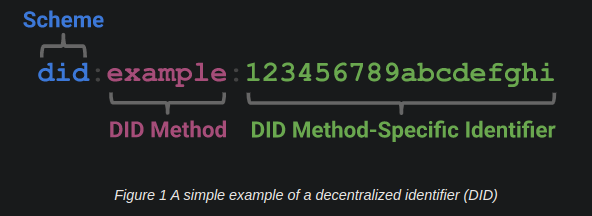
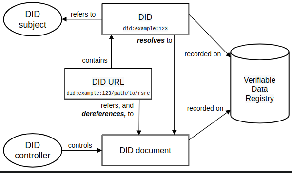
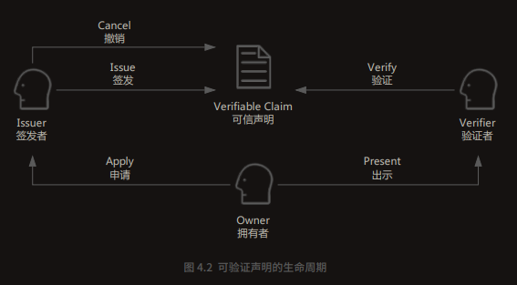
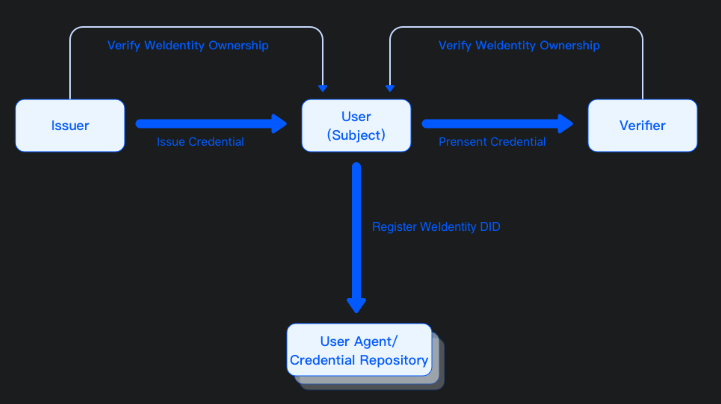

# 去中心化身份DID (Decentralized Identifies)


## 关于去中心化身份DID（Decentralized Identifies）的基本介绍

- (必读)W3C DID规范： https://www.w3.org/TR/did-core/
- 其他介绍DID的文章：
  - https://zhuanlan.zhihu.com/p/77290826
  - https://www.cnblogs.com/studyzy/p/14181526.html
  - https://www.cnblogs.com/studyzy/p/14189910.html


核心概念：

- DID: 由3个部分（scheme、method、 method-specific identifier）组成

    

    一个示例的DID
    ```json
    {
    "@context": [
        "https://www.w3.org/ns/did/v1", // w3规范
        "https://w3id.org/security/suites/ed25519-2020/v1" // 算法版本
    ]
    "id": "did:example:123456789abcdefghi", // DID标识
    "authentication": [{
        "id": "did:example:123456789abcdefghi#keys-1",
        "type": "Ed25519VerificationKey2020",
        "controller": "did:example:123456789abcdefghi",
        "publicKeyMultibase": "zH3C2AVvLMv6gmMNam3uVAjZpfkcJCwDwnZn6z3wXmqPV"
    }]
    }
    ```


- 可验证凭证，VC(Verificable Credential), 是一个 DID 给另一个 DID 的某些属性做背书而发出的描述性声明，并附加自己的数字签名，用以证明这些属性的真实性，可以认为是一种数字证书。
  - VC元数据，包含了发行人、发行日期、声明类型
  - 声明，包含了一些具体信息
  - 证明，对VC的签名，防止VC内容被篡改

- 可验证表达，VP(Verifiable presentation)，可以选择性的披露部分VC的内容
  - VP元数据
  - VC列表，对外展示的VC内容
  - 证明，持有者对本VP的签名

  <!--  -->

  


## DID在国内外使用场景的现状及发展趋势

国内外的DID解决方案:

- 本体 ONTID: https://docs.ont.io/
  - 中文介绍：https://zhuanlan.zhihu.com/p/518885744
  - 中文技术白皮书：https://ont.io/wp/Ontology-technology-white-paper-ZH.pdf
  - ontid相关项目：https://github.com/ont-id
  - Java SDK, 可嵌入Web2: https://github.com/ont-id/vc-java-sdk
  - Go SDK:  https://github.com/ont-id/vc-go-sdk
  - Java SDK,使用ONT ID，结合区块链： https://github.com/ont-id/vc-with-ontid-java-sdk

- sovrin: https://sovrin.org/
- brightid: 
  - https://www.brightid.org/
  - https://brightid.gitbook.io/brightid-zh/
  - App下载：https://drive.google.com/file/d/1EJIFrf8xPNrES6prB4qYaJogtYwEIKCG/edit
- ArcBlock的DID协议 : https://github.com/ArcBlock/abt-did-spec

## 国外的DID框架（基于公链）

以下两个项目，都属于uPort旗下

### serto框架（Typescript）

- https://docs.serto.id/docs/intro

### veramo框架(Typescript)

- https://veramo.io/docs/basics/introduction
- https://github.com/uport-project/veramo


## 国内Fisco Bcos开发的DID项目WeIdentity（有Java SDK， 基于FISCO BCOS联盟链）

WeIdentity 的基本流程图：



**其中`Credential Repository`是区块链智能合约。**

---

- （必读！）WeIdentity规范，https://weidentity.readthedocs.io/zh_CN/latest/docs/weidentity-spec.html
- 官方文档：https://weidentity.readthedocs.io/zh_CN/latest/docs/use-cases.html
- JavaSDK: https://github.com/WeBankFinTech/WeIdentity
- 智能合约： https://github.com/WeBankFinTech/weid-contract


以下内容摘自WeIdentity官方文档：

>
> WeIdentity DID智能合约的功能：
>  - 负责链上ID体系建立，具体包括生成DID（Distributed IDentity）、生成DID Document、DID在链上的读取与更新。
> - WeIdentity Authority智能合约，负责进行联盟链权限管理，具体包括链上DID角色的定义、操作与权限的定义与控制。
> 从业务视角来看，DID智能合约只需要做一件事，就是如何定义DID Document的存储结构和读写方式。DID Document的结构并不复杂（见规范文档）；但在实际的业务中，存在一些挑战：
> 伴随着接入用户（人与物）的快速增长，DID的总量将会增长迅速，规模庞大。因此，设计一个大而全的映射表是不现实的，这会带来巨大的寻址开销，即使采用传统分库、分表、跨链的思路也难以应付。
> DID存在更新的需求。因此，每次都存储完整的Document域在更新情况下会产生大量的历史数据。
> 因此，WeIdentity使用Linked Event：基于事件链的存储方法来解决以上问题。

WeIdContract.sol:
https://github.com/WeBankBlockchain/WeIdentity-Contract/blob/master/contracts/WeIdContract.sol

从合约代码可以看到, weidentity通过event机制，进行数据存储：

```solidity
event WeIdAttributeChanged(
        address indexed identity,
        bytes32 key,
        bytes value,
        uint previousBlock,
        int updated
    );

event WeIdHistoryEvent(
    address indexed identity,
    uint previousBlock,
    int created
);
```

创建credential操作需要和链进行交互。


## 结论

- 从国内外去中心化DID落地的情况来看，基于区块链的完全去中心化DID的实现方案，并不适合绝大多数中心化的项目。
- 从技术层面来看，如果基于区块链实现去中心化的DID方案，技术复杂度高，用户入门门槛高，短期来看并不符合实际需要。

- 助记词（基于公私钥体系）是目前区块链通用的解决方案，此方案更适合当下项目需求。
