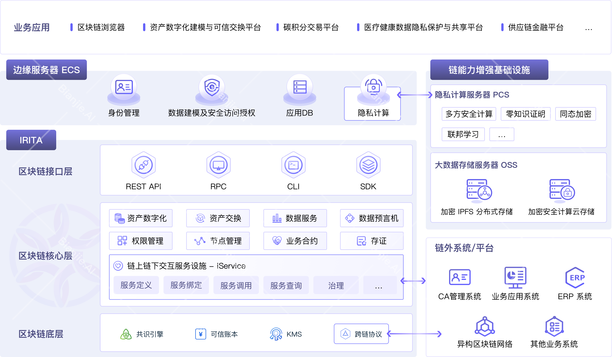
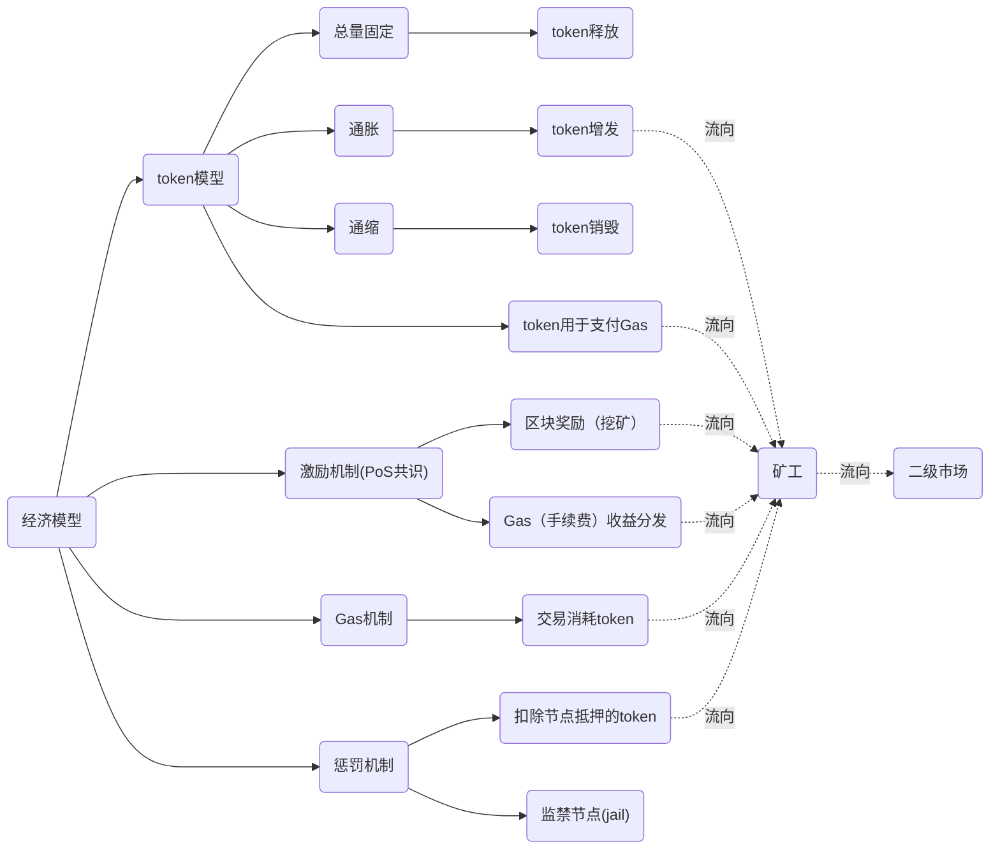
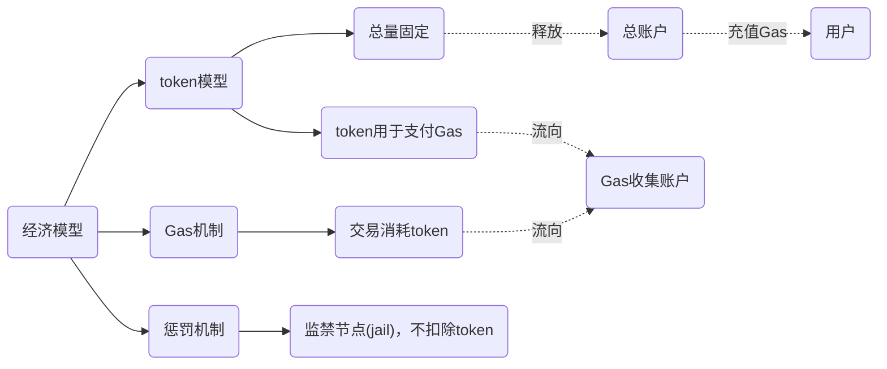

# 基于IRITA构建联盟链的预研

前期预研主要分为以下几个方面

| 确定状态 |预研点 | 
|--|-------|
| √|经济模型设计（核心）| 
| √|PoS&DPoS、挖矿分红| 
| √|Token模块、激励模块、惩罚模块、Gas消耗循环机制|
| √|NFT模块|
| √|DID模块（如何与稀台结合？）|
| √|Upgrade模块,支持在线升级|
| √|Perm模块,权限管理|
| √|虚拟机（EVM、WASM）|
| √|智能合约开发与部署、开发工具|
| √|预言机(中心化和、中心化)，是否需要？|
| √|应用层SDK（比如提供：Go-SDK、Java-SDK、Python-SDK、JS-SDK）|
| √|区块链浏览器（是否需要融合NFT信息，可以作为后期迭代版本增加）|
| ?|用户服务管理台（类似Avata，https://console.avata.bianjie.ai，用户登录，注册，充值，项目管理，链账户管理）|
| √|应用层开放API服务平台(类似:https://apis.avata.bianjie.ai/, 主要用于API批量创建链账户、查询余额、创建NFT、转移NFT、销毁NFT……等等操作)|
| ？ |节点管理台（用于查看节点状态、管理节点，目前irita生态没有，需要自行开发）|
| ?|节点服务器数量、规格、成本|
| ?|开发模块、人员数量、开发时间|





---


## 1.经济模型

经济模型，主要从以下几个方面设计：

- Token模型：
  - 第1种：预分配 + 总量无限，剩余部分通过区块奖励进行释放
  - 第2种：预分配 + 总量有限，剩余部分通过区块奖励进行释放

- 区块激励：
  - 俗称挖矿，POS、DPOS共识下就是通过抵押获得token

- 惩罚机制：
  - 惩罚作恶、离线的节点，扣除一定比例的作恶节点抵押token

- 资源消耗（Gas机制，消耗Token），这个用gas消耗的Token流向哪里？ 
  - 第1种：流向链上的某个总账户（Cosmos的机制）
  - 第2种：销毁（类似以太坊EIP1559），那么需要考虑是否会导致token通缩
  - 第3种：流向矿工（类似BTC）

---

## 2.Irita&文昌链现有的经济模型研究


- ugas总量：`10^27`, `1000000000000000000000000000`

  > https://explorer.wenchang.bianjie.ai/lcd/cosmos/bank/v1beta1/supply

- 目前总账户剩余：`999999579999960227645703532`

- 消耗gas的占总量约 `1/2400000`

- 所有gas充值，都由一个总账户转出，
  > https://explorer.wenchang.bianjie.ai/lcd/bank/balances/iaa14ffm5gc6g698ckmgp63q49963fra4w5aspmrd9

- 随时可以增发

- 消耗的gas去向?
  会统一转向一个固定的地址。那么这个地址是什么角色？

```go
// SendCoinsFromAccountToModule transfers coins from an AccAddress to a ModuleAccount.
// It will panic if the module account does not exist.
func (k BaseKeeper) SendCoinsFromAccountToModule(
	ctx sdk.Context, senderAddr sdk.AccAddress, recipientModule string, amt sdk.Coins,
) error {

	// 有一个专门的地址，收集手续费
	recipientAcc := k.ak.GetModuleAccount(ctx, recipientModule)
	if recipientAcc == nil {
		panic(sdkerrors.Wrapf(sdkerrors.ErrUnknownAddress, "module account %s does not exist", recipientModule))
	}

	return k.SendCoins(ctx, senderAddr, recipientAcc.GetAddress(), amt)
}

```

- 允许代付手续费

- 节点是否有激励机制？
  https://docs.cosmos.network/master/modules/distribution/01_concepts.html

  irita没有`mint`（区块奖励）和`distribution`（手续费分发）模块，所以没有抵押挖矿、代币分发、通胀的机制。

- Staking模块不在irita中, 如何选取主节点?
  没有结合Staking（POS），那么完全依赖Tendermint的BFT协议，所有节点都是平等的，轮流出块。

- 是否有惩罚机制?
  有jail、和unjail机制
  ```go
	// /home/yqq/go/pkg/mod/github.com/bianjieai/cosmos-sdk@v0.44.2-irita-20211102.0.20220517081303-d732ec0ba612/x/slashing/keeper/infractions.go
  	// if we are past the minimum height and the validator has missed too many blocks, punish them
	if height > minHeight && signInfo.MissedBlocksCounter > maxMissed {
		validator := k.sk.ValidatorByConsAddr(ctx, consAddr)
		if validator != nil && !validator.IsJailed() {
			// Downtime confirmed: slash and jail the validator
			// We need to retrieve the stake distribution which signed the block, so we subtract ValidatorUpdateDelay from the evidence height,
			// and subtract an additional 1 since this is the LastCommit.
			// Note that this *can* result in a negative "distributionHeight" up to -ValidatorUpdateDelay-1,
			// i.e. at the end of the pre-genesis block (none) = at the beginning of the genesis block.
			// That's fine since this is just used to filter unbonding delegations & redelegations.
			distributionHeight := height - sdk.ValidatorUpdateDelay - 1

			ctx.EventManager().EmitEvent(
				sdk.NewEvent(
					types.EventTypeSlash,
					sdk.NewAttribute(types.AttributeKeyAddress, consAddr.String()),
					sdk.NewAttribute(types.AttributeKeyPower, fmt.Sprintf("%d", power)),
					sdk.NewAttribute(types.AttributeKeyReason, types.AttributeValueMissingSignature),
					sdk.NewAttribute(types.AttributeKeyJailed, consAddr.String()),
				),
			)
			// iritamod中Slash只是个桩函数，并没有具体内容
			k.sk.Slash(ctx, consAddr, distributionHeight, power, k.SlashFractionDowntime(ctx))
			k.sk.Jail(ctx, consAddr)

			signInfo.JailedUntil = ctx.BlockHeader().Time.Add(k.DowntimeJailDuration(ctx))

			// We need to reset the counter & array so that the validator won't be immediately slashed for downtime upon rebonding.
			signInfo.MissedBlocksCounter = 0
			signInfo.IndexOffset = 0
			k.clearValidatorMissedBlockBitArray(ctx, consAddr)

			logger.Info(
				"slashing and jailing validator due to liveness fault",
				"height", height,
				"validator", consAddr.String(),
				"min_height", minHeight,
				"threshold", minSignedPerWindow,
				"slashed", k.SlashFractionDowntime(ctx).String(),
				"jailed_until", signInfo.JailedUntil,
			)
		} else {
			// validator was (a) not found or (b) already jailed so we do not slash
			logger.Info(
				"validator would have been slashed for downtime, but was either not found in store or already jailed",
				"validator", consAddr.String(),
			)
		}
	}


	// //home/yqq/go/pkg/mod/github.com/bianjieai/iritamod@v1.2.1-0.20220222035322-99168809cf24/modules/node/keeper/validator.go
	// Slash not implement
	func (k Keeper) Slash(ctx sdk.Context, consAddr sdk.ConsAddress, i int64, i2 int64, dec sdk.Dec) {}

  ```
  因为没有staking的机制，当节点掉线超过100个区块时，会启动slashing（惩罚），slashing只是把节点jail（监禁）起来，默认监禁时间是600s。
  
  因为和公链环境不同，联盟链节点都是自家的，节点作恶不作为主要考虑点，所以，节点作恶没有经济上的惩罚。

- 有黑名单机制，黑名单中的地址，不能接受token，也不能发送交易。

---
### 公链（Cosmos）经济模型



---

### 联盟链(irita&文昌链)的经济模型




---
